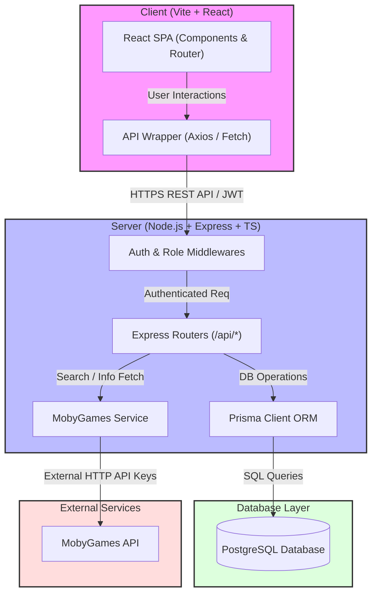
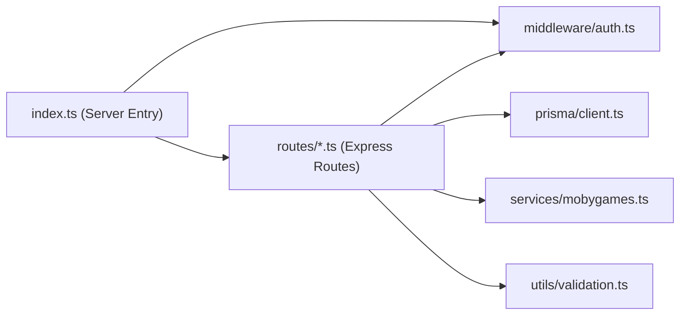

# Software Design Diagrams

This document outlines the software design and architecture for the Game Store Management CRM system.

---

## 1. System Architecture

The CRM application is built on a decoupled client-server architecture:
- **Client (Frontend)**: React Single-Page Application (SPA) built with Vite and TailwindCSS.
- **Server (Backend)**: Node.js Express REST API using TypeScript.
- **Database**: PostgreSQL accessed via Prisma ORM.
- **External Integration**: MobyGames API (used to search cover art, release dates, and platforms for games).

## 2. Logical Components

This diagrams show how backend logical components are modularized.

