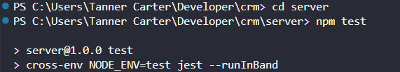

# Game Store CRM - Test Plan

This document lists the test cases and basic instructions to verify that the Game Store Management CRM application works correctly.

---

## 1. How to Run the Tests



To run the automated backend test suite, follow these steps:

1. Open your terminal.
2. Navigate to the `server` directory:
   ```bash
   cd server
   ```
3. Run the tests using the following command:
   ```bash
   npm test
   ```

---

## 2. Test Cases

### 2.1 User Authentication & Roles
| Test ID   | Scenario            | Input / Action                                           | Expected Result                                          |
| :-------- | :------------------ | :------------------------------------------------------- | :------------------------------------------------------- |
| **TC-01** | User Registration   | Submit a new name, email, and password                   | Account created successfully; returns a JWT login token. |
| **TC-02** | User Login          | Submit registered email and password                     | Returns login token and user details.                    |
| **TC-03** | Unauthorized Access | Attempt to fetch inventory without a login token         | Access rejected with a `401 Unauthorized` code.          |
| **TC-04** | Role Restrictions   | Attempt to edit another user's role as a normal employee | Operation blocked with a `403 Forbidden` code.           |

### 2.2 Customer Management
| Test ID   | Scenario         | Input / Action                           | Expected Result                                            |
| :-------- | :--------------- | :--------------------------------------- | :--------------------------------------------------------- |
| **TC-05** | Add Customer     | Submit name, email, and loyalty tier     | Customer is saved in database and returned.                |
| **TC-06** | Validation Check | Submit customer form with an empty name  | Creation fails with a `400 Bad Request` validation error.  |
| **TC-07** | Owner Lookup     | Retrieve customers for specific employee | Returns only the customers assigned to that employee's ID. |

### 2.3 Game Inventory
| Test ID   | Scenario           | Input / Action                                 | Expected Result                                                 |
| :-------- | :----------------- | :--------------------------------------------- | :-------------------------------------------------------------- |
| **TC-08** | Add Game Manually  | Submit title, platform, price, and stock count | Game saved with cover art defaults.                             |
| **TC-09** | Price Check        | Submit a game with a negative price            | Blocked by validation (`400 Bad Request`).                      |
| **TC-10** | Delete Restriction | Try deleting a game that has sales records     | Deletion blocked (`400 Bad Request`) to preserve sales history. |

### 2.4 Sales & Stock Updates
| Test ID   | Scenario              | Input / Action                                     | Expected Result                                                   |
| :-------- | :-------------------- | :------------------------------------------------- | :---------------------------------------------------------------- |
| **TC-11** | Create Pending Sale   | Place a new transaction with status `PENDING`      | Sale saved; game stock levels remain unchanged.                   |
| **TC-12** | Complete Sale         | Place a transaction with status `COMPLETED`        | Sale saved; game stock count is automatically reduced.            |
| **TC-13** | Cancel Completed Sale | Update sale status from `COMPLETED` to `CANCELLED` | Sale updated; game stock count is restored (increased).           |
| **TC-14** | Delete Completed Sale | Delete a finalized transaction                     | Transaction is deleted; game stock count is restored (increased). |
