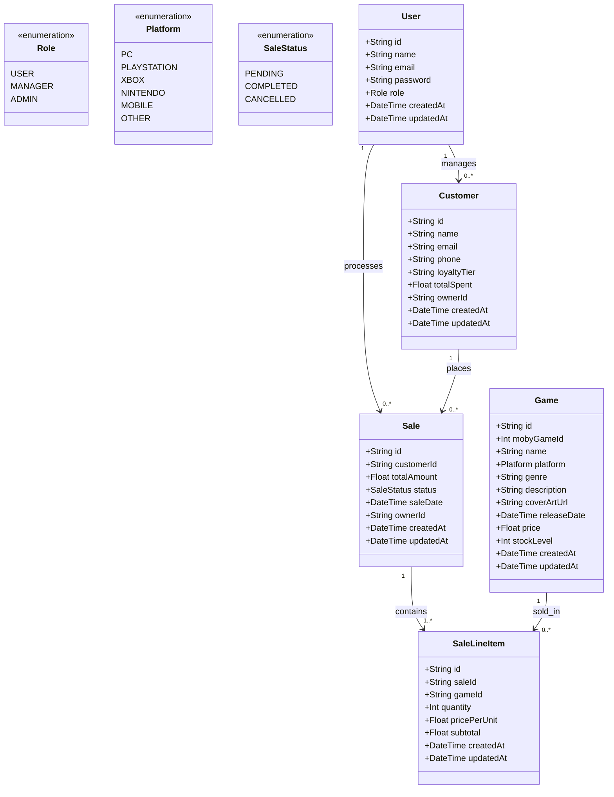

# UML Class Diagram

This diagram shows the database entities, fields, enums, and their relationships inside the Game Store Management CRM system.

```mermaid
classDiagram
    class Role {
        <<enumeration>>
        USER
        MANAGER
        ADMIN
    }

    class Platform {
        <<enumeration>>
        PC
        PLAYSTATION
        XBOX
        NINTENDO
        MOBILE
        OTHER
    }

    class SaleStatus {
        <<enumeration>>
        PENDING
        COMPLETED
        CANCELLED
    }

    class User {
        +String id
        +String name
        +String email
        +String password
        +Role role
        +DateTime createdAt
        +DateTime updatedAt
    }

    class Customer {
        +String id
        +String name
        +String email
        +String phone
        +String loyaltyTier
        +Float totalSpent
        +String ownerId
        +DateTime createdAt
        +DateTime updatedAt
    }

    class Game {
        +String id
        +Int mobyGameId
        +String name
        +Platform platform
        +String genre
        +String description
        +String coverArtUrl
        +DateTime releaseDate
        +Float price
        +Int stockLevel
        +DateTime createdAt
        +DateTime updatedAt
    }

    class Sale {
        +String id
        +String customerId
        +Float totalAmount
        +SaleStatus status
        +DateTime saleDate
        +String ownerId
        +DateTime createdAt
        +DateTime updatedAt
    }

    class SaleLineItem {
        +String id
        +String saleId
        +String gameId
        +Int quantity
        +Float pricePerUnit
        +Float subtotal
        +DateTime createdAt
        +DateTime updatedAt
    }

    User "1" --> "0..*" Customer : manages
    User "1" --> "0..*" Sale : processes
    Customer "1" --> "0..*" Sale : places
    Sale "1" --> "1..*" SaleLineItem : contains
    Game "1" --> "0..*" SaleLineItem : sold_in
```
